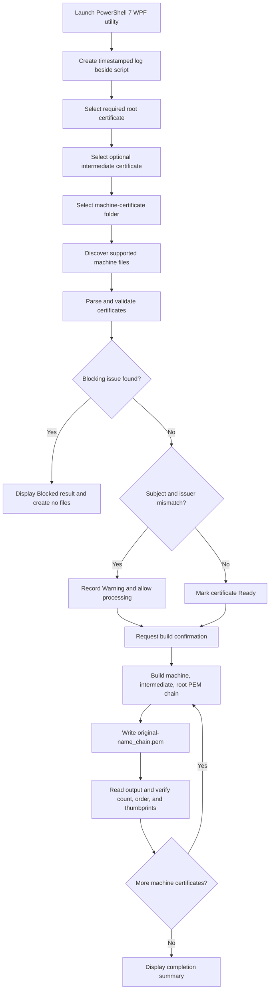

## VCF 9 Certificate Chain Builder

PowerShell 7 and WPF utility for preparing complete **VCF 9 certificate-chain PEM files** from individual machine certificates.

**Current release:** Rev 1.0  
**Script:** `VCF9 Certificate Chain Builder Rev 1.0.ps1`

### Overview

The utility provides an interactive Windows interface for selecting a required root CA certificate, an optional intermediate CA certificate, and a folder containing one or more machine certificates. It creates a separate chain file for every machine certificate without modifying the original file.

Each generated PEM file uses the certificate order required for VCF import:

1. Machine certificate
2. Intermediate certificate, when selected
3. Root certificate

The generated file is written to the machine-certificate folder and named by adding `_chain` to the original base name.

Example:

```text
Original: esxi01.crt
Output:   esxi01_chain.pem
```

### Key Capabilities

- Interactive WPF interface using the Segoe UI font and dark visual theme.
- Required root certificate selection.
- Optional intermediate certificate selection for two-tier chains.
- Folder selection for processing multiple machine certificates.
- Support for PEM and DER X.509 certificate data.
- Support for `.pem`, `.cer`, `.crt`, and `.cr` input extensions.
- Conversion of each certificate into normalized PEM text.
- Automatic chain construction in machine, intermediate, root order.
- Preservation of every original certificate file.
- Output verification by certificate count, order, and thumbprint.
- Validation preview with Ready, Warning, Blocked, Created, and Failed statuses.
- Timestamped logging in the folder containing the script.
- No VMware or third-party PowerShell modules required.

### Requirements

- Windows automation host, administrative workstation, or jump host
- PowerShell 7 or later
- Interactive Windows desktop session with WPF support
- Read access to the root, intermediate, and machine certificate files
- Write access to the machine-certificate folder
- Write access to the folder containing the PowerShell script for log creation

The script uses built-in .NET X.509 certificate APIs. VMware PowerCLI and OpenSSL are not required.

### Supported Certificate Inputs

| Input | Required | Expected contents |
|---|---:|---|
| Root certificate | Yes | One public X.509 CA certificate |
| Intermediate certificate | No | One public X.509 CA certificate |
| Machine-certificate folder | Yes | One public leaf certificate per supported file |

Supported file extensions:

```text
.pem
.cer
.crt
.cr
```

The extension identifies files to inspect. Certificate content must be valid PEM or DER X.509 certificate data.

### Output Format

For a machine certificate named `vcf-component01.crt`, the utility creates:

```text
vcf-component01_chain.pem
```

With an intermediate selected, the generated file contains:

```text
-----BEGIN CERTIFICATE-----
Machine certificate data
-----END CERTIFICATE-----
-----BEGIN CERTIFICATE-----
Intermediate certificate data
-----END CERTIFICATE-----
-----BEGIN CERTIFICATE-----
Root certificate data
-----END CERTIFICATE-----
```

Without an intermediate, the generated file contains:

```text
-----BEGIN CERTIFICATE-----
Machine certificate data
-----END CERTIFICATE-----
-----BEGIN CERTIFICATE-----
Root certificate data
-----END CERTIFICATE-----
```

All output files use the `.pem` extension and are written without a UTF-8 byte-order mark.

### Processing Flow



### UI Workflow

1. Launch the script with PowerShell 7.
2. Confirm the prerequisite indicators show PowerShell, WPF, and X.509 support.
3. Select **Browse Root** and choose the required root certificate.
4. If the chain includes an intermediate CA, select **Browse Intermediate**.
5. For a single-tier chain, leave the intermediate field empty or select **Clear**.
6. Select **Browse Folder** and choose the folder containing only machine certificates.
7. Select **Validate Inputs** to review the discovered certificates.
8. Review Warning or Blocked messages in the results grid and log.
9. Select **Build Chains**.
10. Review the confirmation dialog and select **Yes**.
11. Review the generated `_chain.pem` files and the completion results.

### Validation Behavior

#### Blocking Conditions

The utility prevents chain creation when:

- The root certificate is missing or unreadable.
- The machine-certificate folder is missing or unreadable.
- No supported machine certificate files are found.
- A selected CA certificate contains more than one certificate.
- A machine input file contains more than one certificate.
- A file cannot be parsed as PEM or DER X.509 certificate data.
- Private-key material is detected.
- The selected root is not marked as a Certificate Authority.
- The selected intermediate is not marked as a Certificate Authority.
- A CA certificate is found in the machine-certificate folder.
- A machine certificate matches the selected root or intermediate by thumbprint.
- The selected root or intermediate is stored directly in the mapped machine-certificate folder.

#### Nonblocking Warnings

Subject and issuer linkage differences are logged and displayed as warnings, but do not prevent processing. This includes:

- Machine issuer does not match the selected intermediate subject.
- Machine issuer does not match the root subject when no intermediate is selected.
- Intermediate issuer does not match the root subject.
- Root subject does not match root issuer.
- The selected intermediate appears self-signed based on matching subject and issuer values.

These warnings allow an administrator to proceed when certificate naming or distinguished-name representation does not produce an exact text match.

### Existing Output Files

Files whose base name already ends in `_chain` are excluded from the input inventory.

If a target `_chain.pem` file already exists, the utility:

- Displays a Warning status during validation.
- Requests explicit overwrite confirmation before building.
- Leaves the original machine certificate unchanged.
- Replaces only the existing generated chain file after confirmation.

### Post-Write Verification

After writing each output, the utility reads the generated PEM file and verifies:

- The expected certificate count.
- The expected certificate thumbprints.
- The required certificate order.
- Machine certificate first.
- Intermediate certificate second, when present.
- Root certificate last.

A verification problem marks that machine certificate as Failed and records the error in the log.

### Log Files

The log is created in the same folder as the executing script:

```text
VCF-Certificate-Chain-Builder-YYYYMMDD-HHMMSS.log
```

Example:

```text
C:\Automation\VCF9 Certificate Chain Builder Rev 1.0.ps1
C:\Automation\VCF-Certificate-Chain-Builder-20260817-093000.log
```

If the script folder cannot be resolved, the current working directory is used as a fallback.

### Status Values

| Status | Meaning |
|---|---|
| Ready | The certificate passed validation without a warning. |
| Warning | Processing is allowed, but linkage differs or an output file already exists. |
| Blocked | A validation condition prevents all chain creation. |
| Created | The chain file was written and successfully verified. |
| Failed | The file could not be written or did not pass post-write verification. |

### Running the Script

Because the file name contains spaces, enclose the path in quotation marks:

```powershell
pwsh.exe -NoProfile -ExecutionPolicy Bypass -File ".\VCF9 Certificate Chain Builder Rev 1.0.ps1"
```

The script relaunches itself in STA mode when required for the WPF interface.

### Troubleshooting

#### Build Chains is disabled

Confirm that:

- A root certificate has been selected.
- A valid machine-certificate folder has been selected.

The intermediate certificate is optional.

#### A machine certificate shows Warning

Review the Message column and log. A subject and issuer mismatch is informational and does not prevent chain creation. Confirm that the administrator selected the intended root and intermediate files before continuing.

#### Validation is blocked because a CA certificate was found

Remove all root and intermediate CA files from the machine-certificate folder. The mapped folder must contain only leaf or machine certificate files. Existing files ending in `_chain` are ignored.

#### A private key was detected

Use public certificate files only. Do not place files containing `BEGIN PRIVATE KEY`, `BEGIN RSA PRIVATE KEY`, `BEGIN EC PRIVATE KEY`, or encrypted private-key blocks in the selected inputs.

#### An output already exists

The utility warns before overwriting generated chain files. Select **Yes** only when the existing `_chain.pem` outputs should be replaced.

#### A certificate cannot be read

Confirm that the file contains a valid X.509 certificate in PEM or DER form. Renaming an unrelated text file to `.pem`, `.cer`, `.crt`, or `.cr` does not convert the content into a certificate.

#### PowerShell or WPF issue

Run the script with PowerShell 7 in an interactive Windows desktop session. Server Core and noninteractive sessions may not support the WPF interface.

### Security Notes

- The utility processes public certificates only.
- Private-key content is rejected and is not copied to an output file.
- Original machine certificate files are not modified.
- Generated chains and logs may reveal host names, distinguished names, certificate issuers, certificate subjects, thumbprints, and file paths.
- Protect output and logs according to organizational security and retention requirements.
- Review all Warning results before importing certificates into VCF.
- Test the utility in a controlled environment before production use.
- Retain the original certificates and previous script revision for rollback and audit purposes.

### Version History

#### Rev 1.0

- Initial GitHub release.
- Added PowerShell 7 WPF interface and prerequisite checks.
- Added required root and optional intermediate selection.
- Added bulk machine-certificate folder processing.
- Added PEM and DER X.509 parsing.
- Added normalized machine, intermediate, root PEM-chain construction.
- Added `_chain.pem` output naming while preserving source files.
- Added CA-folder contamination and private-key controls.
- Added nonblocking subject and issuer linkage warnings.
- Added overwrite confirmation for existing chain files.
- Added post-write certificate count, order, and thumbprint verification.
- Added timestamped logging beside the executing script.

### Operational Guidance

Test the script and generated chains in a controlled, nonproduction workflow before production import. Confirm that the selected CA files are the intended trust chain for the target VCF certificates. Retain the source certificates, generated files, script revision, and log together when required for change-control evidence.

